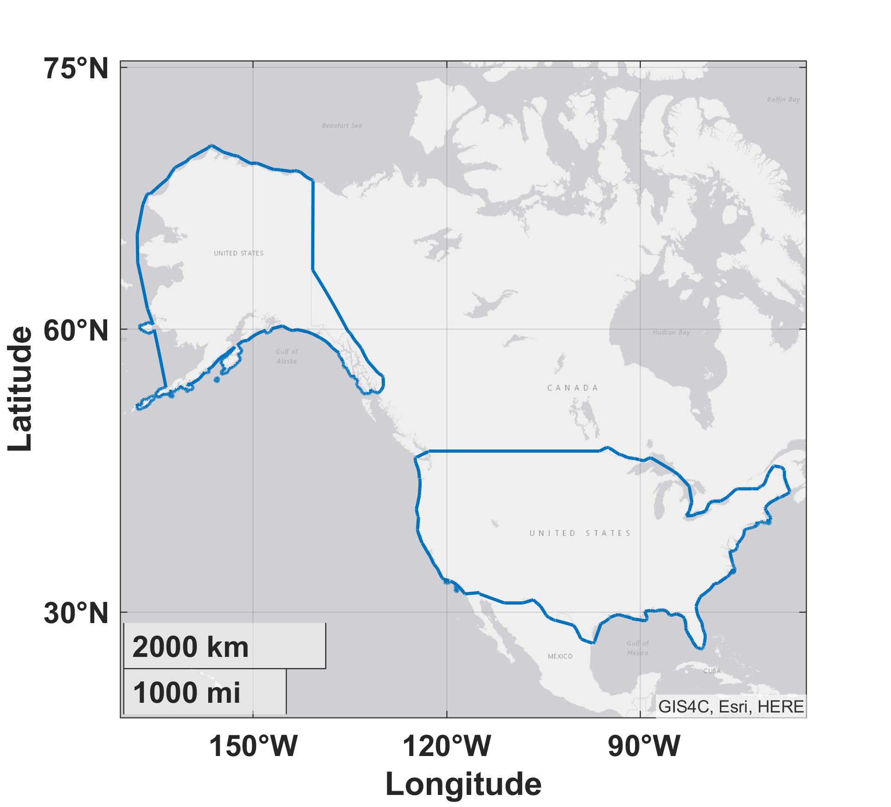

# Bayesian Network Encounter Models

The Bayesian network encounter models are a collection of MATLAB scripts that produce random samples from models of how different aircraft behave, as previously documented in MIT Lincoln Laboratory technical reports. All these models were originally developed by [MIT Lincoln Laboratory](https://www.ll.mit.edu/). Majority of these samples are of one independent aircraft track and a single sample is insufficient for a complete synthetic encounter. Refer to the [`em-overview/README`](https://github.com/Airspace-Encounter-Models/em-overview/blob/master/README.md#documentation) for model documentation. Also please refer to other software and documentation on how to fully generate an encounter.

Each manned aircraft model is a set of Bayesian Networks, a representation of a multivariate probability distribution as a directed acyclic graph. Models are trained using aircraft operational data derived from radar or other sensing system flight track data. For example, this figure illustrates the initial Bayesian network for the extended uncorrelated encounter model.

<p align="center">  </p>

- [Bayesian Network Encounter Models](#bayesian-network-encounter-models)
  - [Nomenclature](#nomenclature)
  - [Initial Setup](#initial-setup)
    - [Persistent System Environment Variable](#persistent-system-environment-variable)
    - [em-core](#em-core)
  - [Run Order](#run-order)
    - [Startup script](#startup-script)
    - [Classes (Object-Oriented Programming)](#classes-object-oriented-programming)
    - [Run Scripts](#run-scripts)
  - [Datafiles and Documentation](#datafiles-and-documentation)
    - [Correlated Extended Model](#correlated-extended-model)
    - [Uncorrelated Conventional Aircraft](#uncorrelated-conventional-aircraft)
      - [RADES-Based](#rades-based)
      - [OpenSky Network-Based](#opensky-network-based)
    - [GPS-Based Uncorrelated Unconventional Aircraft Models](#gps-based-uncorrelated-unconventional-aircraft-models)
    - [ETMS-Based Due Regard Model](#etms-based-due-regard-model)
    - [DFDR-Based Helicopter Air Ambulance Model](#dfdr-based-helicopter-air-ambulance-model)
    - [Correlated Terminal Model](#correlated-terminal-model)
  - [Common Categorical Variables](#common-categorical-variables)
    - [Geographic Domain (G)](#geographic-domain-g)
    - [Airspace Class (A)](#airspace-class-a)
  - [Frequently Asked Questions](#frequently-asked-questions)
    - [Are these models location specific?](#are-these-models-location-specific)
    - [Does sampling the models create a complete encounter between aircraft?](#does-sampling-the-models-create-a-complete-encounter-between-aircraft)
    - [How do I create tracks with initial altitudes outside a model's altitude scope?](#how-do-i-create-tracks-with-initial-altitudes-outside-a-models-altitude-scope)
    - [Do the models account for traffic density?](#do-the-models-account-for-traffic-density)
    - [Can the models inform how encounters can be weighted?](#can-the-models-inform-how-encounters-can-be-weighted)
    - [How can I use the models to calculate a risk ratio?](#how-can-i-use-the-models-to-calculate-a-risk-ratio)
    - [Does this repository include the code to train a new encounter model?](#does-this-repository-include-the-code-to-train-a-new-encounter-model)
  - [Citation](#citation)
  - [Distribution Statement](#distribution-statement)

## Nomenclature

Acronym | Phrase
 :--- | :---
CPA | [closest point of approach](https://www.skybrary.aero/index.php/Closest_Point_of_Approach_(CPA))
CONUS | [Contiguous United States](https://en.wikipedia.org/wiki/Contiguous_United_States)
DFDR | [Digital Flight Data Recorder](https://en.wikipedia.org/wiki/Flight_recorder)
ADS-B | [Automatic Dependent Surveillance-Broadcast](https://www.faa.gov/nextgen/programs/adsb/)
AGL| above ground level
ETMS | [Enhanced Traffic Management System](https://en.wikipedia.org/wiki/Enhanced_Traffic_Management_System)
FOQA | [Flight Operational Quality Assurance](https://en.wikipedia.org/wiki/Flight_operations_quality_assurance)
HAA | [Helicopter Air Ambulance](https://www.faa.gov/regulations_policies/advisory_circulars/index.cfm/go/document.information/documentid/1027108)
RADES | [84th Radar Evaluation Squadron](https://www.505ccw.acc.af.mil/About-Us/Fact-Sheets/Display/Article/376111/84th-radar-evaluation-squadron/)

## Initial Setup

This section specifies the initial setup for the repository.

### Persistent System Environment Variable

Immediately after cloning this repository, [create a persistent system environment](https://superuser.com/q/284342/44051) variable titled `AEM_DIR_BAYES` with a value of the full path to this repository root directory.

In unix there are many ways to do this, here is an example using [`/etc/profile.d`](https://unix.stackexchange.com/a/117473). Create a new file `aem-env.sh` using `sudo vi /etc/profile.d/aem-env.sh` and add the command to set the variable:

```bash
export AEM_DIR_BAYES=PATH TO /em-model-manned-bayes
```

You can confirm `AEM_DIR_BAYES` was set in unix by inspecting the output of `env`.


If you would like to create synthetic tracks from Canadian data, you would need to clone [`Canadian Airspace Models`](https://github.com/nrc-cnrc/Canadian-Airspace-Models).
After cloning, [create a persistent system environment](https://superuser.com/q/284342/44051) variable titled `CANADIAN_MODELS` with a value of the full path to /Canadian-Airspace-Models/Matlab_Frequency_Tables.

```bash
export CANADIAN_MODELS=PATH TO /Canadian-Airspace-Models/Matlab_Frequency_Tables
```

You can confirm `CANADIAN_MODELS` was set in unix by inspecting the output of `env`.

### em-core

Clone [`em-core`](https://github.com/Airspace-Encounter-Models/em-core). Confirm that the system environment variable `AEM_DIR_CORE` has been set, as instructed by its [README](https://github.com/Airspace-Encounter-Models/em-core/blob/master/README.md#persistent-system-environment-variable). Please confirm you have compiled the mex function, `run_dynamics_fast`.

## Run Order

This section describes main object-oriented programming (OOP) classes and example run scripts.

### Startup script

When first launching MATLAB, please run the startup script, `start_bayes`, to set the path and other configurations.

### Classes (Object-Oriented Programming)

The latest release introduces object oriented programming with the addition of the `EncounterModel` and `EncounterModel_CA` superclasses, `UncorEncounterModel`,`UncorEncounterModel_CA`and`CorTerminalModel` classes. These classes enable the user to easily read in the MIT ASCII parameter files as well as Canadian .mat files with improved input handling. Classes are not yet available for the RADES-based correlated, ETMS-based due regard, DFDR-based HAA, and most unconventional models.

### Run Scripts

The run script, [`RUN_uncor`](./code/matlab/RUN_uncor.m), demonstrates how using `UncorEncounterModel` can sample the uncorrelated encounter model or generate local Cartesian or geodetic uncorrelated tracks with a few lines of code. A similar run script, [`RUN_terminal`](./code/matlab/RUN_terminal.m) demonstrates the basic functionality of the correlated terminal encounter model. The run script, [`RUN_uncor_CA`](./code/matlab/RUN_uncor_CA.m), demonstrates how using `UncorEncounterModel_CA` can sample and create tracks from the Canadian encounter model. 

## Datafiles and Documentation

Refer to the [`em-overview/README`](https://github.com/Airspace-Encounter-Models/em-overview/blob/master/README.md#documentation) for references to the technical documentation for each model. Each model has an altitude scope based on how the training data was processed for each model and the discretization of the altitude layer in the model's initial network. This scope should be used to determine the applicability of the model given a specific use case or analysis.

Furthermore, the initial network for each model aggregates all the training observations across the training time window. It does not provide guidance on the density of aircraft. For example, suppose that a model was trained using 2 days of data. If 80% of the observations were from the first day, it would produce an initial network exactly the same if only 20% of the observations were from the first day.

### Correlated Extended Model

These Bayesian network models are trained on observed encounters between transponder-equipped (cooperative) aircraft. The training data were processed pairs of tracks of aircraft equipped with mode [Mode 3A/C](https://en.wikipedia.org/wiki/Air_traffic_control_radar_beacon_system) transponders and observed by one of over 200 ground-based primary and secondary surveillance radars managed by the RADES. The following figure illustrates the maximum theoretical surveillance volume for each radar. Actual radar range varies based on a variety of factors, such as altitude and nearby terrain.

<p align="center">  </p>

The extended correlated model was trained from more than 500,000 flight hours from cooperative aircraft, and the extended uncorrelated from more than 290,000 flight hours of 1200-code aircraft.

Filename | Model | Description (Version) | Altitude Scope
:---  | :---  | :---  | :---:  
[cor_v1.txt](./model/cor_v1.txt) | correlated | Aircraft squawking a Mode 3A/C discrete code over the CONUS (v1.1) | [1000, Inf]
[cor_v2p1.txt](./model/cor_v2p1.txt) | correlated | Aircraft squawking a Mode 3A/C discrete code (v2.1) | [1000, Inf]
[littoral_cor_v1.txt](./model/littoral_cor_v1.txt) (deprecated) | uncorrelated | Aircraft squawking a Mode 3A/C discrete code over littoral regions (v1.0)  | [1000, 45000]

### Uncorrelated Conventional Aircraft

Uncorrelated models assume aircraft behavior is not dependent on air traffic services or nearby aircraft. While trained using observations of cooperative aircraft equipped with transponders, they are often used as surrogates to model noncooperative aircraft not equipped with transponders.

#### RADES-Based

These Bayesian network models are trained using observations of 1200-code aircraft equipped with [Mode 3A/C](https://en.wikipedia.org/wiki/Air_traffic_control_radar_beacon_system) transponders and observed by a radar managed by the RADES. The training dataset was sourced from the same radars as the [correlated extended model](#correlated-extended-model). The extended uncorrelated was trained from more than 290,000 flight hours of 1200-code aircraft.

Filename | Model | Description (Version) | Altitude Scope
:---  | :---  | :---  | :---:  
[uncor_1200_code_v1.txt](./model/uncor_1200code_v1.txt) | uncorrelated | Aircraft squawking Mode 3A/C of 1200 over the CONUS (v1.0) <br> Surrogate for conventional aircraft without transponders | [500, 18000]
[uncor_1200_code_v2p1.txt](./model/uncor_1200code_v2p1.txt) | uncorrelated | Aircraft squawking Mode 3A/C of 1200 (v2.x) <br> Surrogate for conventional aircraft without transponders | [500, 18000]
[littoral_uncor_v1.txt](./model/littoral_uncor_v1.txt) (deprecated) | correlated | Aircraft squawking Mode 3A/C of 1200 over littoral regions (v1.0) | [500, 18000]

#### OpenSky Network-Based

These Bayesian network models are trained from observations by the [OpenSky Network](https://github.com/openskynetwork) of [ADS-B](https://www.faa.gov/nextgen/programs/adsb/) equipped aircraft. The OpenSky Network collects data via a worldwide network of crowdsourced receivers of ADS-B, an operational surveillance technology for tracking aircraft. The network, started in 2012 with 12 European sensors, has grown to over a thousand worldwide active sensors. ADS-B equipped aircraft automatically self-report their position to ground stations and other equipped aircraft. Also the annual national aircraft registries of the United States, Canada, Ireland, and the Netherlands were used to identify aircraft type based on the Mode S ICAO24 address from the ADS-B data.

Version 1.2 of these models were trained from observations for 104 Mondays across 2018-2020. Observations from more than 380,000 flight hours below 5,000 feet AGL were used to train these models. Training data was limited to the following geographic regions:

<p align="center">  </p>

These models use the same directed acyclic graph as the [RADES-based](#rades-based) uncorrelated 1200-code model. The initial network was slightly modified by adding a lower altitude bin of [50, 500] feet AGL and changing the highest altitude bin to [3000, 5000] feet AGL. Similar to the RADES-based 1200-code model, transponder [Mode 3A/C](https://en.wikipedia.org/wiki/Air_traffic_control_radar_beacon_system) filtering was completed when training these models. Refer to this [AIAA journal article](https://doi.org/10.2514/1.D0254) for guidance on which models can be surrogates for aircraft not equipped with ADS-B.

Filename | Model | Description (Version) | Altitude Scope
:---  | :---  | :---  | :---:  
[uncor_1200exclude_fwme_v1p2.txt](./model/uncor_1200exclude_fwme_v1p2.txt) | uncorrelated | Fixed wing multi-engine with ADS-B Out not squawking Mode 3A/C of 1200 (v1.2) | [50, 5000]
[uncor_1200only_fwme_v1p2.txt](./model/uncor_1200only_fwme_v1p2.txt) | uncorrelated | Fixed wing multi-engine with ADS-B Out squawking Mode 3A/C of 1200 (v1.2) <br> Surrogate for conventional aircraft without transponders | [50, 5000]
[uncor_1200exclude_fwse_v1p2.txt](./model/uncor_1200exclude_fwse_v1p2.txt) | uncorrelated | Fixed wing single-engine with ADS-B Out not squawking Mode 3A/C of 1200 (v1.2)| [50, 5000]
[uncor_1200only_fwse_v1p2.txt](./model/uncor_1200only_fwse_v1p2.txt) | uncorrelated | Fixed wing multi-single with ADS-B Out squawking Mode 3A/C of 1200 (v1.2) <br> Surrogate for conventional aircraft without transponders | [50, 5000]
[uncor_1200exclude_rotorcraft_v1p2.txt](./model/uncor_1200exclude_rotorcraft_v1p2.txt) | uncorrelated | Fixed wing multi-engine with ADS-B Out not squawking Mode 3A/C of 1200 (v1.2) | [50, 5000]
[uncor_1200only_rotorcraft_v1p2.txt](./model/uncor_1200only_rotorcraft_v1p2.txt) | uncorrelated | Rotorcraft with ADS-B Out squawking Mode 3A/C of 1200 (v1.2) <br> Surrogate for conventional aircraft without transponders | [50, 5000]
[uncor_allcode_fwmulti_v1.txt](./model/uncor_allcode_fwmulti_v1.txt) (deprecated) | uncorrelated | Rotorcraft with ADS-B Out (v1.0) | [50, 5000]
[uncor_allcode_fwsingle_v1.txt](./model/uncor_allcode_fwsingle_v1.txt) (deprecated) | uncorrelated | Fixed wing single-engine with ADS-B Out (v1.0) | [50, 5000]
[uncor_allcode_rotorcraft_v1.txt](./model/uncor_allcode_rotorcraft_v1.txt) (deprecated) | uncorrelated | Rotorcraft with ADS-B Out (v1.0) | [50, 5000]

### GPS-Based Uncorrelated Unconventional Aircraft Models

This set of models were trained using more than 96,000 global unconventional aircraft tracks. Training data was sourced from multiple continents but the trained model does not include a geographic variable. These models were developed developed in response to the [RADES-based](#rades-based) 1200-code model not being sufficiently representative all types of noncooperative aircraft.

<p align="center">    </p>

It is set of nine individual Bayesian network models encompassing ultralights, gliders, balloons, and airships.

Filename | Model | Description (Version) | Altitude Scope
:---  | :---  | :---  | :---:  
[balloon_v1.txt](./model/balloon_v1.txt) | uncorrelated | Hot air balloons (v1.0) | [0, 10000]
[blimp_v1.txt](./model/blimp_v1.txt) | uncorrelated | Airships (v1.0) | [0, 10000]
[fai1_v1.txt](./model/fai1_v1.txt) | uncorrelated | Flexible wing hang gliders (v1.0) | [0, 10000]
[fai5_v1.txt](./model/fai5_v1.txt) | uncorrelated | Rigid wing hang gliders (v1.0) | [0, 10000]
[glider_v1.txt](./model/glider_v1.txt) | uncorrelated | Gliders (v1.0) | [0, 10000]
[paraglider_v1.txt](./model/paraglider_v1.txt) | uncorrelated | Paragliders (v1.0) | [0, 10000]
[paramotor_v1.txt](./model/paramotor_v1.txt) | uncorrelated | Paramotors (v1.0) | [0, 10000]
[skydiving_v1.txt](./model/skydiving_v1.txt) | uncorrelated | Skydivers (v1.0) | [0, 15000]
[weatherballoon_v1.txt](./model/weatherballoon_v1.txt) | uncorrelated | Weather balloons (v1.0) | [0, 120000]

### ETMS-Based Due Regard Model

A Bayesian network trained using using the ETMS data feed that was provided by the [Volpe Center](https://www.volpe.dot.gov/) to describe aircraft operating in international airspace. Training data included operations over the Atlantic and Pacific oceans and consisted of over 10,000 flight hours. The following figure illustrates the density of manned tracks used for model training.

<p align="center">  </p>

This model includes only one Bayesian network.

Filename | Model | Description (Version) | Altitude Scope
:---  | :---  | :---  | :---:  
[dueregard_v1.txt](./model/dueregard_v1.txt) | [due regard](https://github.com/Airspace-Encounter-Models/em-overview/blob/master/README.md#manned-due-regard) | Aircraft participating in the ETMS (v1.0) | (0, Inf]

### DFDR-Based Helicopter Air Ambulance Model

A Bayesian network trained from an estimated 2,526,000 observations across 758 flight hours. The training observations were sourced from FOQA DFDR data provided by a Massachusetts-based HAA provider. This model should only be used to simulate HAA rotorcraft operations, it has not been validated to be representative of other rotorcraft operations.

While the Bayesian model is currently available and included in the [model directory](./model/README.md), formal technical documentation has not been fully released for the model yet. Also note that the altitude layer variable in this model has units of feet MSL, whereas majority of the models use feet AGL. We are planning to release a dataset of sampled trajectories to enable model use and accessability.

Filename | Model | Description (Version) | Altitude Scope
:---  | :---  | :---  | :---:  
[haa_v1.txt](./model/haa_v1.txt) | HAA | Rotorcraft of a Massachusetts-based HAA operator | (0, 5000]

### Correlated Terminal Model

*This model is in active development, with significant updates and additional documentation expected through 2022.*

A set of Bayesian networks tailored to address structured terminal operations, i.e., correlations between trajectories and the airfield and each other. It was specifically trained to support [RTCA SC-228](https://www.rtca.org/sc-228/) development of the [DO-365](https://my.rtca.org/nc__store?search=do-365) minimum operational performance standard (MOPS). The model is comprised to two main elements. The first component, the encounter geometry model, describes the geometrical conditions of two encounter aircraft at their point of closest approach. The second component, the trajectory generation model, then describes the flight path for each aircraft leading to and continuing from their point of closest approach.

This model is unique in that it is one of the few correlated models and the only to have a separate encounter geometry model. The correlated extended model has a single dynamic Bayesian network that captures both the relative geometry of the two aircraft and the dynamic states of each aircraft. The terminal model differs in that the relative geometry at CPA is modeled by the encounter geometry model and the dynamics of each aircraft are represented by aircraft trajectory models. There is a different trajectory model for each aircraft (ownship and intruder), with similar model structures. Furthermore these models were trained based on encounters where ownship was executing a straight-in landing or straight-out takeoff. There was no such restrictions on the intruder.

Encounter Geometry Model | Aircraft Trajectory Models
:---:  | :---:  
 |    

Two variants of this model have been trained. While the model structure is the same between the variants, different datasets were used for training. These two datasets were 1) FAA terminal radar track data over the period January through September 2015 throughout the NAS and 2) 190+ days of data over the period January 2019 through February 2020 from the OpenSky Network. These two sources of data have different assumptions and surveil different types of aircraft. Training multiple models enabled assessments of the sensitivity of the models to different biases; while mitigating some weakness for a given dataset.

Data source | Model | Description (Version) | Altitude Scope
:---  | :---  | :---  | :---:  
[OpenSky Network-based](./model/correlated_terminal/opensky/README.md) | correlated | Encounters near aerodromes observed by the OpenSky Network | [200, 5000]
[Terminal area radar](./model/correlated_terminal/terminalradar/README.md) | correlated | Encounters near aerodromes observed by terminal area radars | [200, 5000]

## Common Categorical Variables

Many variables in the statistical encounter models correspond to discretized kinematics, such speed or vertical rate. However, some variables are categorical discrete variables encoded as integers. Since these categorical variables are not self-evident, we provide a brief description of common categorical variables here. Please refer to specific model documentation for details.

### Geographic Domain (G)

Aircraft behavior may vary across different geographic regions due to varying weather patterns, fleet mix, navigation equipage, regulations, mission types, and other factors. Including a variable denoting the geographic domain allows the model to be customized to the different environments in which aircraft operate.

| Value  |  Description
| :-----:| :--  
| 1 | Mainland USA and Alaska
| 2 | Islands (e.g. Hawaii, Puerto Rico, U.S. Virgin Islands)
| 3 | Offshore of Mainland USA
| 4 | Offshore of Islands
| 5 | Mainland Canada (*recently introduced in v1.2 of the OpenSky Network models*)

The following figures illustrates the onshore geographic domains for version 1.2 of the uncorrelated [OpenSky Network-based models](#opensky-network-based-models). Note that the version 1.2 uncorrelated models are the first models to include Canada as a distinct geographic domain. Additional research is required to determine if modeled aircraft behavior is statistically different between the Canadian and contiguous United States geographic domains. Also, version 1.0 of the OpenSky Network-based models and the RADES-based models each calculated the geographic domain variable slightly differently.

<p align="center">    </p>
<p align="center">    </p>

### Airspace Class (A)

This variable was incorporated into the models to account for the variation in how aircraft fly in different airspace classes. The FAA airspace class data is downloaded and parsed using the [`em-core`](https://github.com/Airspace-Encounter-Models/em-core) repository.

| Value  |  Description
| :-----:| :--  
| 1 | Class B
| 2 | Class C
| 3 | Class D
| 4 | Other (Class A, E, G, F)

## Frequently Asked Questions

### Are these models location specific?

The models describe the behavior of aircraft across large geographic regions, such as the CONUS, and are not specific to smaller regions, such as New York City. When developing the initial v1.x [RADES-based models](#rades-based), it was assessed and determined there was not a significant statistical difference in aircraft behavior between operations Los Angeles and New York. When developing the v2.x [RADES-based models](#rades-based), the dependence of aircraft behavior on location was reassessed. It was determined that behavior was dependent on geographic features, such as if an aircraft was operating over the ocean or the CONUS.

### Does sampling the models create a complete encounter between aircraft?

No, with the exception of the [RADES-based models](#rades-based) correlated model, model samples can be used to create individual and independent aircraft tracks. For an uncorrelated encounter, a single aircraft trajectory is sampled from an encounter model which is paired with a different, separately sampled trajectory to create one encounter. A collection of encounters, often used for Monte Carlo simulations, are referred to as an encounter set. For correlated encounters, both aircraft are sampled together from the same encounter model. These independent tracks need to be paired together to create an encounter.

### How do I create tracks with initial altitudes outside a model's altitude scope?

It is strongly recommended against using the models to assess aircraft behavior outside the prescribed altitude scope. The model scope is based on the altitudes of the aircraft observations used to train the models. For example, the [RADES-based model](#rades-based) 1200-code model was trained using observations of aircraft at 500 feet AGL or above. Since this model was not trained with observations at lower altitudes, it may not be representative of aircraft flying below 500 feet AGL. We do not provide any supporting material to justify that the models are representative of aircraft behavior outside their prescribed altitude scope.

### Do the models account for traffic density?

No, the encounter models do not provide information on the density of manned aircraft behavior per unit time.  The encounter model initial network aggregates all the observations across the training time window. It does not provide guidance on the density of aircraft.

### Can the models inform how encounters can be weighted?

There are many ways to weight encounters, including weighing based on the likelihood a specific encounter geometry may occur or the relative collision risk of the encounter. One simple way encounters can be weighted is based on the relative speed at the closets point of approach or the average relative speed for the entire encounter. For uncorrelated encounters, the relative speed is based on two independent samples from the models.

Regardless of how the weights are calculated, weighting can be applied post-simulation of encounters based on encounter model samples.

### How can I use the models to calculate a risk ratio?

The risk ratio is independent of the traffic density, and measures the efficacy of detect and avoid system at mitigating collision risk. The risk ratio can be coupled with estimates of the unmitigated (without the system) collision frequency to produce an overall estimate of the mitigated collision frequency.

### Does this repository include the code to train a new encounter model?

No, this repository does not include the software used by MIT LL to train encounter models. There are currently no plans to publicly release that software.

## Citation

Please use this DOI number reference when citing the software:

[](https://doi.org/10.5281/zenodo.3827100)

## Distribution Statement

DISTRIBUTION STATEMENT A. Approved for public release. Distribution is unlimited.

© 2008-2021 Massachusetts Institute of Technology.

This material is based upon work supported by the Federal Aviation Administration (FAA) and the National Aeronautics and Space Administration (NASA) under Air Force Contract No. FA8702-15-D-0001. Any opinions, findings, conclusions or recommendations expressed in this material are those of the author(s) and do not necessarily reflect the views of the FAA or NASA.

Delivered to the U.S. Government with Unlimited Rights, as defined in DFARS Part 252.227-7013 or 7014 (Feb 2014). Notwithstanding any copyright notice, U.S. Government rights in this work are defined by DFARS 252.227-7013 or DFARS 252.227-7014 as detailed above. Use of this work other than as specifically authorized by the U.S. Government may violate any copyrights that exist in this work.

This document is derived from work done for the FAA (and possibly others), it is not the direct product of work done for the FAA. The information provided herein may include content supplied by third parties.  Although the data and information contained herein has been produced or processed from sources believed to be reliable, the Federal Aviation Administration makes no warranty, expressed or implied, regarding the accuracy, adequacy, completeness, legality, reliability or usefulness of any information, conclusions or recommendations provided herein. Distribution of the information contained herein does not constitute an endorsement or warranty of the data or information provided herein by the Federal Aviation Administration or the U.S. Department of Transportation.  Neither the Federal Aviation Administration nor the U.S. Department of Transportation shall be held liable for any improper or incorrect use of the information contained herein and assumes no responsibility for anyone’s use of the information. The Federal Aviation Administration and U.S. Department of Transportation shall not be liable for any claim for any loss, harm, or other damages arising from access to or use of data or information, including without limitation any direct, indirect, incidental, exemplary, special or consequential damages, even if advised of the possibility of such damages. The Federal Aviation Administration shall not be liable to anyone for any decision made or action taken, or not taken, in reliance on the information contained herein.
