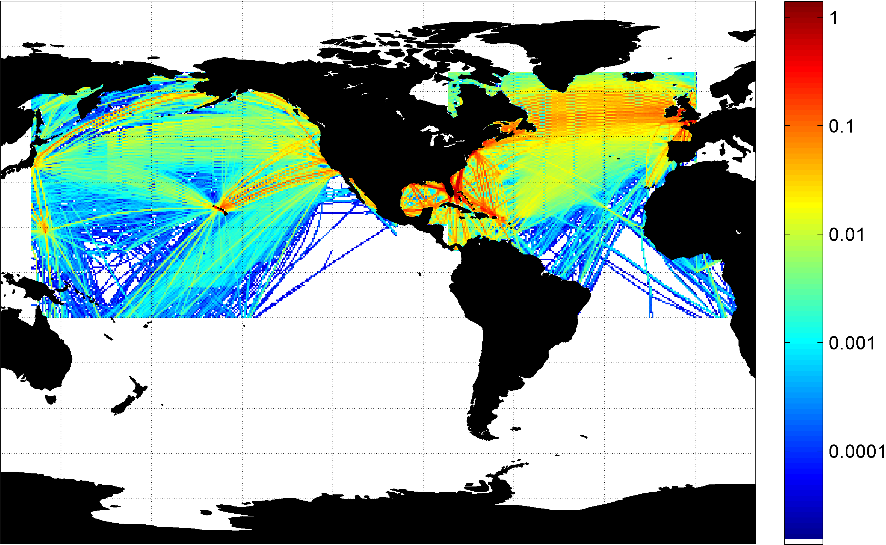

# Bayesian Network Encounter Models

The Bayesian network encounter models are a collection of MATLAB scripts that produce random samples from models of how different aircraft behave, as previously documented in MIT Lincoln Laboratory technical reports. All these models were originally developed by MIT Lincoln Laboratory. Majority of these samples are of one independent aircraft track and a single sample is insufficient for a complete synthetic encounter. Refer to the [`em-overview/README`](https://github.com/Airspace-Encounter-Models/em-overview/blob/master/README.md#documentation) for model documentation. Also please refer to other software and documentation on how to fully generate an encounter.

Each manned aircraft model model is a Bayesian Network, a representation of a multivariate probability distribution as a directed acyclic graph. Models are trained using aircraft operational data derived from radar or other sensing system flight track data. For example, the following figure illustrates the initial Bayesian network for the extended uncorrelated encounter model.

<p align="center">  </p>

- [Bayesian Network Encounter Models](#bayesian-network-encounter-models)
  - [Nomenclature](#nomenclature)
  - [Run Order](#run-order)
    - [Persistent System Environment Variable](#persistent-system-environment-variable)
    - [Sample the Model](#sample-the-model)
    - [Generate Basic Tracks](#generate-basic-tracks)
  - [Datafiles and Documentation](#datafiles-and-documentation)
    - [Primary RADES-Based Models](#primary-rades-based-models)
    - [Unconventional Model](#unconventional-model)
    - [Due Regard Model](#due-regard-model)
    - [Helicopter Air Ambulance](#helicopter-air-ambulance)
    - [Littoral Model](#littoral-model)
  - [Distribution Statement](#distribution-statement)

## Nomenclature

Acronym | Phrase
 :--- | :---
ETMS | [Enhanced Traffic Management System](https://en.wikipedia.org/wiki/Enhanced_Traffic_Management_System)
FOQA | [Flight Operational Quality Assurance](https://en.wikipedia.org/wiki/Flight_operations_quality_assurance)
HAA | [Helicopter Air Ambulance](https://www.faa.gov/regulations_policies/advisory_circulars/index.cfm/go/document.information/documentid/1027108)
RADES | [84th Radar Evaluation Squadron](https://www.505ccw.acc.af.mil/About-Us/Fact-Sheets/Display/Article/376111/84th-radar-evaluation-squadron/)

## Run Order

This section specifies the initial setup and run order for the repository.

### Persistent System Environment Variable

Immediately after cloning this repository, [create a persistent system environment](https://superuser.com/q/284342/44051) variable titled `AEM_DIR_BAYES` with a value of the full path to this repository root directory.

On unix there are many ways to do this, here is an example using [`/etc/profile.d`](https://unix.stackexchange.com/a/117473). Create a new file `aem-env.sh` using `sudo vi /etc/profile.d/aem-env.sh` and add the command to set the variable:

```bash
export AEM_DIR_BAYES=PATH TO /em-model-manned-bayes
```

You can confirm `AEM_DIR_BAYES` was set in unix by inspecting the output of `env`.

### Sample the Model

 The main function is [`em_sample`](./code/matlab/em_sample.m) and we provide a run script,[`RUN_1_emsample`](./code/matlab/RUN_1_emsample.m), which calls the function. The function's input is are parameter files that describe the model's properties. The parameter files are located in the [model directory](./model/README.md).

### Generate Basic Tracks

The run script, [`RUN_2_sample2track`](./code/matlab/RUN_2_sample2track.m), calls [`sample2track`](./code/matlab/sample2track.m) to generate basic (x,y,z) tracks for some of the model samples. Not all model samples are supported and only uncorrelated, glider (unconventional), and paraglider (unconventional) samples have been tested with the function.

## Datafiles and Documentation

Refer to the [`em-overview/README`](https://github.com/Airspace-Encounter-Models/em-overview/blob/master/README.md#documentation) for references to the technical documentation for each model.

### Primary RADES-Based Models

Bayesian network models trained using 1200-code aircraft tracks or encounters between transponder-equipped (cooperative) aircraft. Training data for the extended models was sourced from over 200 ground-based air surveillance radars managed by the RADES. The extended correlated model was trained from more than 500,000 flight hours and the extended uncorrelated from more than 290,000 flight hours. The following figure illustrates the maximum theoretical surveillance volume for each radar. Actual radar range varies based on a variety of factors, such as altitude and nearby terrain.

<p align="center">  </p>

There are two models trained with RADES data and each model has been updated once to enable extended simulation times. The correlated model is the only model that explicitly models two aircraft.

Filename | Model | Description
:---  | :---  | :---  
[cor_v1.txt](./models/cor_v1.txt) | [correlated](https://github.com/Airspace-Encounter-Models/em-overview/blob/master/README.md#manned-correlated-model) | Correlated encounter model (Version 1.1)
[cor_v2p1.txt](./model/cor_v2p1.txt) | [correlated](https://github.com/Airspace-Encounter-Models/em-overview/blob/master/README.md#manned-correlated-model) | Extended correlated encounter model (Version 2.1)
[uncor_v1.txt](./models/uncor_v1.txt) | [uncorrelated](https://github.com/Airspace-Encounter-Models/em-overview/blob/master/README.md#manned-uncorrelated-model) | Uncorrelated encounter model (Version 1.0)
[uncor_v2p2.txt](./model/uncor_v2p2.txt) | [uncorrelated](https://github.com/Airspace-Encounter-Models/em-overview/blob/master/README.md#manned-uncorrelated-model) | Extended uncorrelated encounter model (Version 2.2)

### Unconventional Model

This set of models were trained using more than 96,000 global unconventional aircraft tracks. Training data was sourced from multiple continents but the trained model does not include a geographic variable.

<p align="center">    </p>

It is set of nine individual Bayesian network models encompassing ultralights, gliders, balloons, and airships.

Filename | Model | Description
:---  | :---  | :---  
[balloon_v1.txt](./model/balloon_v1.txt) | [unconventional](https://github.com/Airspace-Encounter-Models/em-overview/blob/master/README.md#manned-unconventional-model) | Hot air balloons
[blimp_v1.txt](./model/blimp_v1.txt) | [unconventional](https://github.com/Airspace-Encounter-Models/em-overview/blob/master/README.md#manned-unconventional-model) | Airships
[fai1_v1.txt](./model/fai1_v1.txt) | [unconventional](https://github.com/Airspace-Encounter-Models/em-overview/blob/master/README.md#manned-unconventional-model) | Flexible wing hang gliders
[fai5_v1.txt](./model/fai5_v1.txt) | [unconventional](https://github.com/Airspace-Encounter-Models/em-overview/blob/master/README.md#manned-unconventional-model) | Rigid wing hang gliders
[glider_v1.txt](./model/glider_v1.txt) | [unconventional](https://github.com/Airspace-Encounter-Models/em-overview/blob/master/README.md#manned-unconventional-model) | Gliders
[paraglider_v1.txt](./model/paraglider_v1.txt) | [unconventional](https://github.com/Airspace-Encounter-Models/em-overview/blob/master/README.md#manned-unconventional-model) | Paragliders
[paramotor_v1.txt](./model/paramotor_v1.txt) | [unconventional](https://github.com/Airspace-Encounter-Models/em-overview/blob/master/README.md#manned-unconventional-model) | Paramotors
[skydiving_v1.txt](./model/skydiving_v1.txt) | [unconventional](https://github.com/Airspace-Encounter-Models/em-overview/blob/master/README.md#manned-unconventional-model) | Skydivers
[weatherballoon_v1.txt](./model/weatherballoon_v1.txt) | [unconventional](https://github.com/Airspace-Encounter-Models/em-overview/blob/master/README.md#manned-unconventional-model) | Weather balloons

### Due Regard Model

A Bayesian network trained using using the ETMS data feed that was provided by the Volpe Center to describe aircraft operating in international airspace. Training data included operations over the Atlantic and Pacific oceans and consisted of over 10,000 flight hours. The following figure illustrates the density of manned tracks used for model training.

<p align="center">  </p>

This model includes only one Bayesian network.

Filename | Model | Description
:---  | :---  | :---  
[dueregard-v1p0.txt](./model/dueregard-v1p0.txt) | [due regard](https://github.com/Airspace-Encounter-Models/em-overview/blob/master/README.md#manned-due-regard) | Due regard encounter model (Version 1.0)

### Helicopter Air Ambulance

A Bayesian network describe trained using about 750 flight hours of FOQA data provided by a Massachusetts-based HAA provider. The Bayesian model is currently not available and not included in the [model directory](./model/README.md).

### Littoral Model

A Bayesian network model that describes how aircraft behave in the littoral regions of the United States. This model has been deprecated by the extended [RADES-based models](#primary-rades-based-models).

Filename | Model | Description
:---  | :---  | :---  
[littoral_uncor_v1.txt](./model/littoral_uncor_v1.txt) | [littoral](https://github.com/Airspace-Encounter-Models/em-overview/blob/master/README.md#manned-littoral-model) | Uncorrelated conventional (Version 1.0) |
[littoral_cor_v1.txt](./model/littoral_cor_v1.txt) | [littoral](https://github.com/Airspace-Encounter-Models/em-overview/blob/master/README.md#manned-littoral-model) | Correlated (Version 1.0) |

## Distribution Statement

DISTRIBUTION STATEMENT A. Approved for public release. Distribution is unlimited.

© 2020 Massachusetts Institute of Technology.

This material is based upon work supported by the Federal Aviation Administration under Air Force Contract No. FA8702-15-D-0001.

Delivered to the U.S. Government with Unlimited Rights, as defined in DFARS Part 252.227-7013 or 7014 (Feb 2014). Notwithstanding any copyright notice, U.S. Government rights in this work are defined by DFARS 252.227-7013 or DFARS 252.227-7014 as detailed above. Use of this work other than as specifically authorized by the U.S. Government may violate any copyrights that exist in this work.

Any opinions, findings, conclusions or recommendations expressed in this material are those of the author(s) and do not necessarily reflect the views of the Federal Aviation Administration.

This document is derived from work done for the FAA (and possibly others), it is not the direct product of work done for the FAA. The information provided herein may include content supplied by third parties.  Although the data and information contained herein has been produced or processed from sources believed to be reliable, the Federal Aviation Administration makes no warranty, expressed or implied, regarding the accuracy, adequacy, completeness, legality, reliability or usefulness of any information, conclusions or recommendations provided herein. Distribution of the information contained herein does not constitute an endorsement or warranty of the data or information provided herein by the Federal Aviation Administration or the U.S. Department of Transportation.  Neither the Federal Aviation Administration nor the U.S. Department of Transportation shall be held liable for any improper or incorrect use of the information contained herein and assumes no responsibility for anyone’s use of the information. The Federal Aviation Administration and U.S. Department of Transportation shall not be liable for any claim for any loss, harm, or other damages arising from access to or use of data or information, including without limitation any direct, indirect, incidental, exemplary, special or consequential damages, even if advised of the possibility of such damages. The Federal Aviation Administration shall not be liable to anyone for any decision made or action taken, or not taken, in reliance on the information contained herein.
